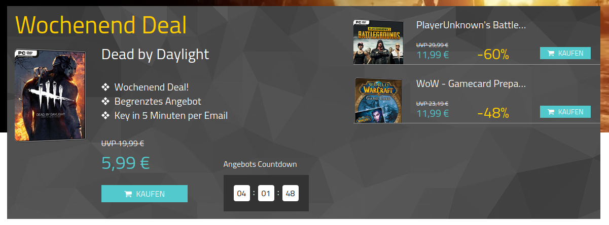
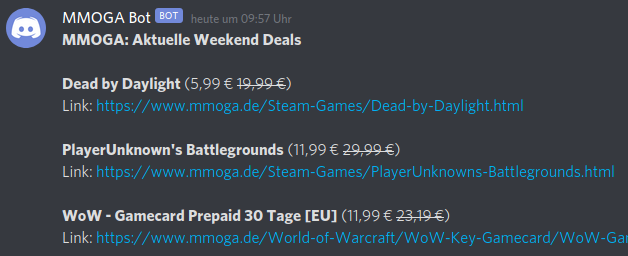

# Discord Bot for MMOGA Weekend Sales

With this Python script the Weekend Deals can be read from mmoga.de and posted to your discord server. The Python script must then be executed once a week, e.g. by a cron job.

### Result
Sales come from mmoga.de



Discord Screenshot



### Requirements
- Python 3
- Python pip to install all packages
- Discord Bot & Server (Client ID, Server Name, Target Server Channel)

### Install
1. Setup local python virtual environment
```
python3 -m venv .
```

2. Install all dependencies
```
pip install -r requirements.txt
```

3. Create an Environment File (.env)
```
DISCORD_TOKEN=[Insert Bot Token]
DISCORD_GUILD=[Insert Server ID]
DISCORD_CHANNEL=[Insert Channel ID]
MMOGA_LINK=https://www.mmoga.de
```

4. Run
```
python app.py
```